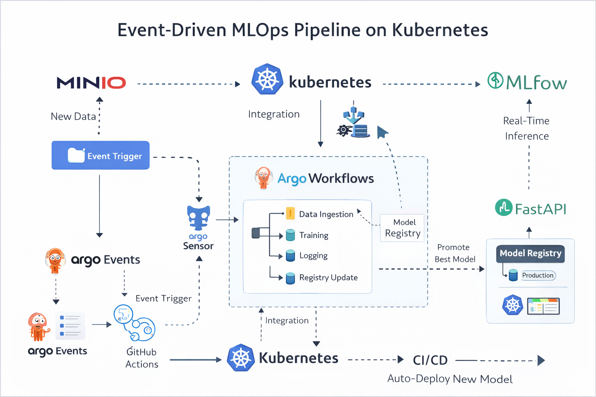
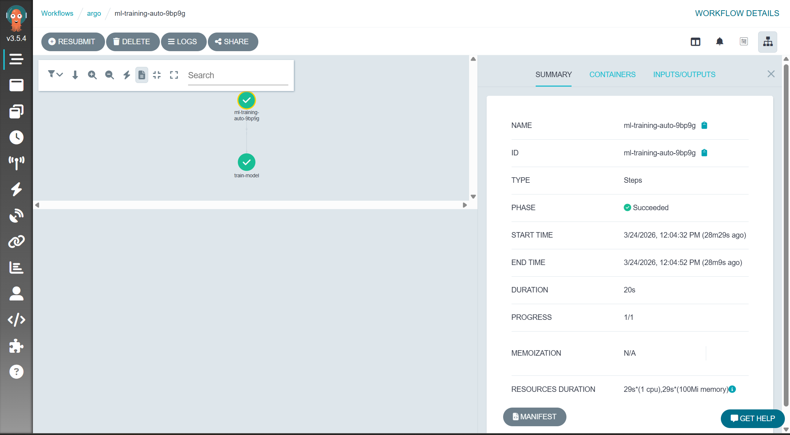
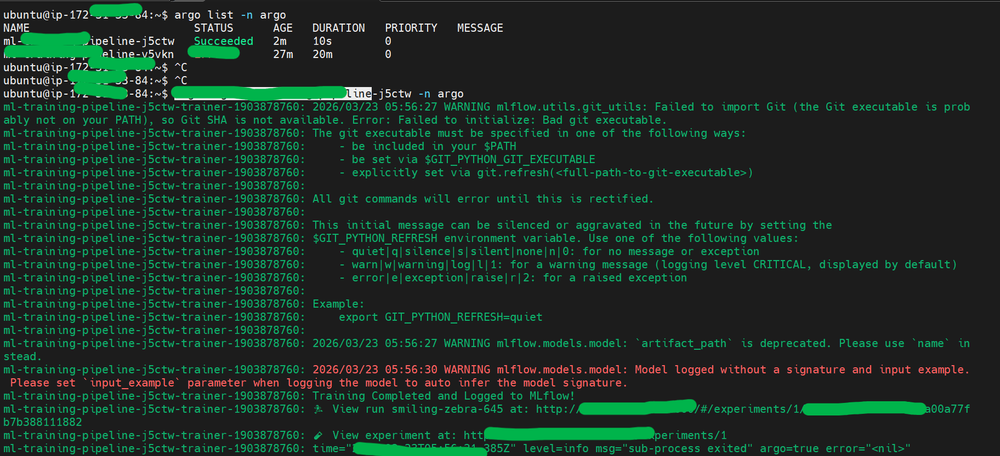
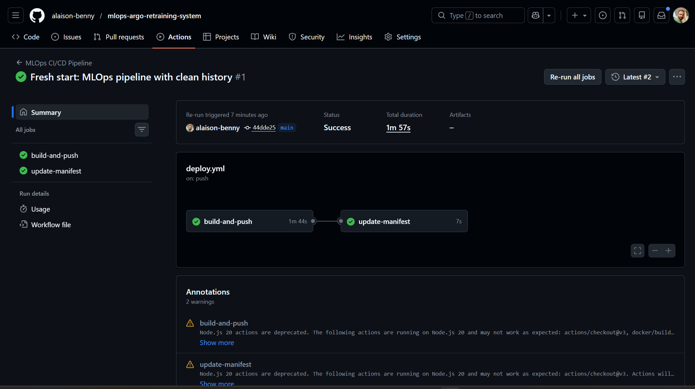

# 🚀 Event-Driven MLOps Pipeline on Kubernetes

## 🔍 What is this project?

A fully automated, production-grade MLOps system that retrains ML models whenever new data arrives—using Kubernetes-native orchestration, experiment tracking, CI/CD, and real-time serving.

---

## 🧠 Project Description

This pipeline automates the entire ML lifecycle:
- Tracks experiments with MLflow
- Promotes best models to registry
- Serves models via FastAPI
- Retrains automatically when new data arrives in MinIO
- Deploys updates via GitHub Actions + ArgoCD

---

## ⚙️ Technologies Used

| Layer              | Tools Used                                  |
|-------------------|----------------------------------------------|
| Experimentation   | Python, Scikit-learn, Pandas, MLflow         |
| Serving           | FastAPI, Docker                              |
| Orchestration     | Kubernetes (Minikube), Argo Workflows        |
| Event Trigger     | MinIO (S3), Argo Events                      |
| CI/CD             | GitHub Actions, ArgoCD                       |

---

## 🧭 Architecture Diagram



> End-to-end flow: MinIO → Argo Events → Argo Workflows → MLflow → FastAPI → GitHub Actions → Kubernetes

---

## 🪜 Steps Done

### Phase 1: MLflow Core & Experiment Tracking
- Setup: Python venv, MLflow, scikit-learn, pandas
- MLflow UI hosted locally/EC2
- Logs parameters, metrics, artifacts

### Phase 2: Model Registry & Serving
- Best model promoted to Production stage
- FastAPI inference service pulls latest production model
- Dockerized FastAPI app

### Phase 3: Automated Retraining with Argo Workflows
- Kubernetes setup via Minikube
- DAG: data ingestion → training → logging → registry update
- Argo Events detect new data in MinIO → trigger retraining
- CI/CD: GitHub Actions build Docker image + update manifests

---

## 📸 Screenshots

### ✅ Argo Workflow UI – Successful Retraining



> DAG execution of training pipeline triggered by new data.

---

### 📋 Argo CLI Logs – MLflow Training Run



> Logs show MLflow warnings, training completion, and run URL.

---

### 🔁 GitHub Actions – CI/CD Pipeline Success



> Automated build + manifest update triggered by code push.

---

## 🚀 How to Run

```bash
# Step 1: Deploy MinIO + MLflow + FastAPI
kubectl apply -f minio-deployment.yaml
kubectl apply -f minio-service.yaml
kubectl apply -f mlflow-deployment.yaml
kubectl apply -f fastapi-deployment.yaml

# Step 2: Upload new data to MinIO
mc alias set minio http://localhost:9000 minio minio123
mc cp ./data/new_data.csv minio/input-data/

# Step 3: Trigger Argo Events + Workflow
kubectl apply -f minio-event-source.yaml
kubectl apply -f minio-sensor.yaml
kubectl apply -f train-workflow.yaml

# Step 4: View MLflow UI
http://<EC2-IP>:5000

# Step 5: CI/CD (auto triggered via GitHub Actions)
